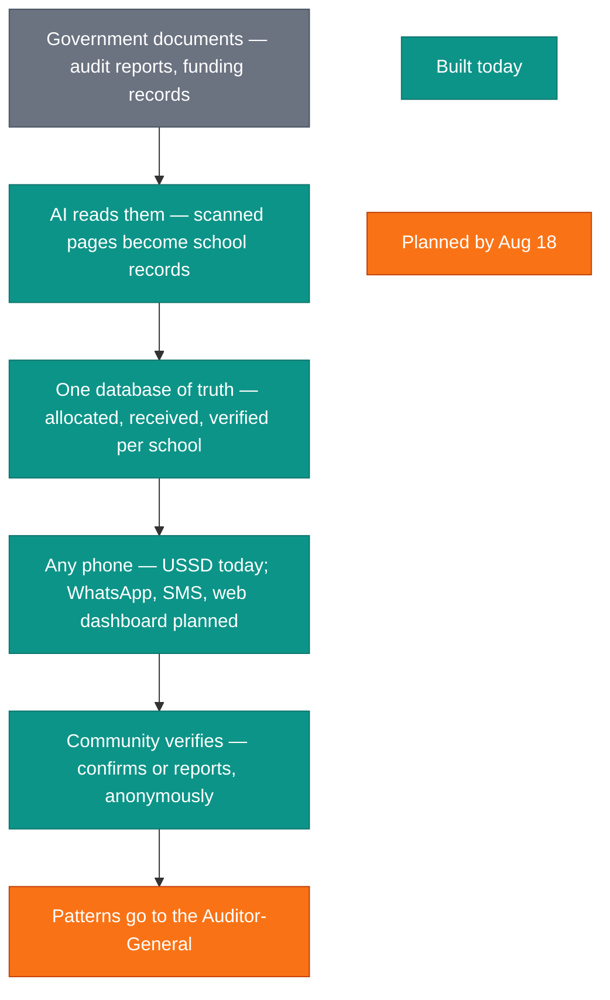
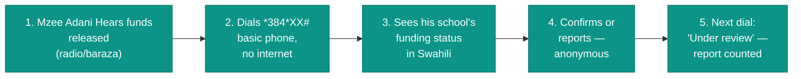
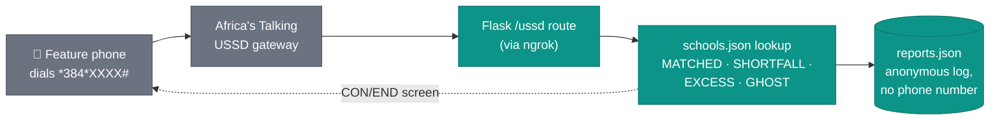

# Hakikisha Shule

> Built during the **Democracy & AI Hackathon** — July 4th, 2026
> Hosted by **Mozilla Foundation** & **KamiLimu**

---

## Team

| Name | Role | GitHub |
|------|------|--------|
| [Full Name] | [Role, e.g. Backend] | [@handle] |

**Team Name:** [Insert Team Name]
**University:** [Insert University Name]

---

## Problem & User

### Problem Statement

Parents, teachers, and community members in rural Kenya have no accessible
way to verify whether their school actually received its allocated
government capitation funds, or whether the school is even a verified
institution — leaving "ghost school" fraud and funding shortfalls
undetected until an audit surfaces it, years later.

### Target User

| Dimension | Detail |
|-----------|--------|
| **Primary user** | A parent, teacher, or community member in Isiolo County, Kenya |
| **Tech comfort** | Comfortable dialling USSD codes daily for M-Pesa; no smartphone or data required |
| **Language** | Swahili and English |
| **Current workflow** | Has no way to check capitation records short of a physical visit to the county education office |

### The Specific Gap

1. **What's already there:** Auditor-General audit reports; Ministry of Education capitation disbursement records.
2. **Why it falls short:** Published as lengthy English PDFs, months or years after disbursement, requiring a desktop browser and advanced literacy.
3. **The gap we fill:** Instant, bilingual (Swahili/English) capitation verification over USSD — no internet, no smartphone, no PDFs — with a built-in anonymous reporting loop.

Full breakdown: [`docs/problem-statement.md`](docs/problem-statement.md)

### Why It Matters

When rural citizens can't verify how capitation funds were disbursed to
their school, "ghost schools" and misallocation go unnoticed until a formal
audit — often years later. Closing this information gap restores a basic
democratic feedback mechanism: informed citizens can flag discrepancies the
moment they suspect something is wrong, not after the money is long gone.

---

## Run Instructions

### Prerequisites

- Python 3.10+
- [ngrok](https://ngrok.com/download) (free account) — to expose the local server to Africa's Talking's sandbox
- An [Africa's Talking](https://account.africastalking.com/) sandbox account with a USSD channel configured

### Quick Start

```bash
# 1. Clone the repo
git clone https://github.com/[org]/[repo].git
cd [repo]

# 2. Create a virtual environment
python -m venv venv
source venv/bin/activate   # Windows: venv\Scripts\activate

# 3. Install dependencies
pip install -r requirements.txt

# 4. Run the Flask app
python src/app.py            # serves on http://0.0.0.0:5000

# 5. In a second terminal, expose it with ngrok
ngrok http 5000

# 6. Copy the https://<random>.ngrok-free.app URL ngrok prints, and set it
#    (with /ussd appended) as the Callback URL on your Africa's Talking
#    sandbox USSD channel. Then dial your assigned service code in the
#    AT Simulator.
```

No `.env` file or API keys are required — the app is fully self-contained
and uses mock data from `src/schools.json`.

---

## 📁 Project Structure

```
.
├── README.md                   ← You are here
├── docs/
│   └── problem-statement.md    ← Detailed problem breakdown
├── src/
│   ├── app.py                  ← Flask entry point — single /ussd route
│   ├── schools.json            ← Mock capitation records (seed data)
│   └── reports.json            ← Anonymous discrepancy reports (generated at runtime, gitignored)
├── data/
│   └── .gitkeep
├── requirements.txt
├── .env.example
├── .gitignore
└── LICENSE
```

---

## Architecture



## User journey



---

## Approach & Architecture

A single-file Flask app handles Africa's Talking's USSD callback. Because
USSD is stateless, the app replays the full input path on every request to
reconstruct where the user is in the menu — which is what makes "0. Back"
work at any level without a database or session store.



Each school's capitation record is classified into one of four states from
its `allocated` / `disbursed` / `verified` fields, and the menu options and
screen text shown to the user adapt accordingly — including surfacing a
"Chini ya ukaguzi / Under review" flag once a school has accumulated
discrepancy reports.

---

## License

MIT © [Team Name], 2026

---
