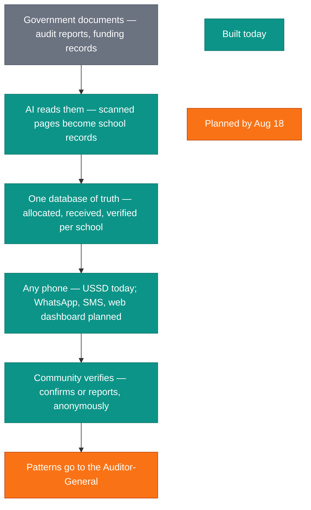
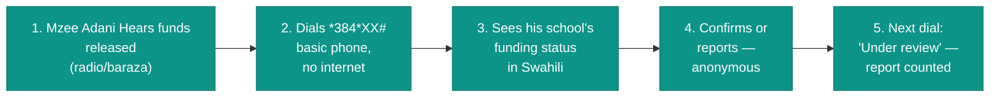
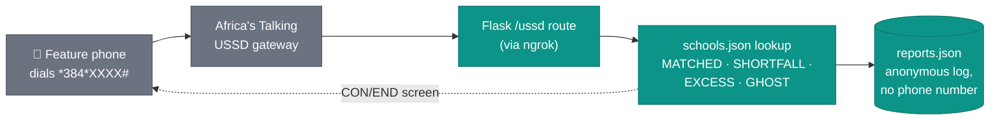

# Hakikisha Shule

> Built during the **Democracy & AI Hackathon** — July 4th, 2026
> Hosted by **Mozilla Foundation** & **KamiLimu**

---

## Team

| Name | Role | GitHub |
|------|------|--------|
| Mercy Cherotich | Systems & AI | mercy-rotich |
|Phenny Mwaisaka  |Research & Product |Mwaisaks |

**Team Name:** Dira
**University:** Meru University of science and technology

---

## Problem & User

### Problem Statement

Boards of Management (BOMs) and parents of public schools in Kenya's
marginalized counties have no way to verify whether their school received
its allocated government capitation — or whether schools receiving funds
in their name even exist. The 2025 Auditor-General Special Audit found
Ksh 3.7 billion disbursed to 33 non-existent schools and a Ksh 117 billion
capitation shortfall, with discrepancies spanning 32 counties. The
Ministry's subsequent verification named ghost schools county by county —
including Bisanavi, Eldara and Kambi Otha in Isiolo, and Loiwat High and
Maji Mazuri Mixed in Baringo — and found 87,000 ghost learners. Fraud at
this scale persisted for four audit years because the one group that can
physically verify a school — its own community — has no channel into the
records.

### Target User

| Dimension | Detail |
|-----------|--------|
| **Primary user** | Board of Management (BOM) member of a public school — statutory oversight mandate under the Basic Education Act; one board per school |
| **Secondary beneficiaries** | Parents and community members |
| **Pilot context** | Isiolo County — 3 ghost schools named in the Ministry's 2025 verification; pastoralist mobile schools make it the hardest verification test |
| **Tech comfort** | Dials USSD daily for M-Pesa; basic phone, no data bundle |
| **Language** | Swahili and English today; Borana, Somali, Samburu, Turkana on the roadmap (community-validated) |
| **Current workflow** | No option short of a physical visit to the county education office — and even there, per-school disbursement records are not public |

### The Specific Gap

1. **What exists:** the OAG Special Audit (published as a 100-page
   *scanned* PDF — no searchable text) and NEMIS/KEMIS (internal,
   login-only government systems).
2. **Why it falls short:** the audit's per-school details are deferred to
   Annexures 35–38, which are not included in the published document —
   we verified this by running our own OCR pipeline over every page. The
   new KEMIS system (rolling out since January 2026) fixes the
   government's data problem but remains government-facing.
3. **The gap we fill:** no Kenyan civic-tech tool delivers school-level
   capitation verification for ghost-school checks via USSD/SMS to
   offline BOM members. Existing platforms (Mzalendo, PesaYetu) are
   web-based and county-level. DIRA is the citizen-facing verification
   layer: instant, bilingual, any phone — with an anonymous reporting
   loop back to oversight bodies.

Full breakdown: [`docs/problem-statement.md`](docs/problem-statement.md)

### Why It Matters

Capitation is computed from enrollment data no citizen can see or dispute,
so falsifying a registry entry carries near-zero detection risk. The theft
ran for four consecutive audit years before one special audit exposed it.
DIRA inverts the oversight model: the 11 million learners' communities
become a continuous, distributed verification layer — confirming honest
disbursements, flagging discrepancies the moment funds land, and
operationalizing Article 35 (access to information) in service of
Article 43 (the right to education). Detection by the community, in
term time — not by one audit, years late.

## Run Instructions

### Prerequisites

- Python 3.10+
- [ngrok](https://ngrok.com/download) (free account) — to expose the local server to Africa's Talking's sandbox
- An [Africa's Talking](https://account.africastalking.com/) sandbox account with a USSD channel configured

### Quick Start

```bash
# 1. Clone the repo
git clone https://github.com/[org]/[repo].git
cd [repo]

# 2. Create a virtual environment
python -m venv venv
source venv/bin/activate   # Windows: venv\Scripts\activate

# 3. Install dependencies
pip install -r requirements.txt

# 4. Run the Flask app
python src/app.py            # serves on http://0.0.0.0:5000

# 5. In a second terminal, expose it with ngrok
ngrok http 5000

# 6. Copy the https://<random>.ngrok-free.app URL ngrok prints, and set it
#    (with /ussd appended) as the Callback URL on your Africa's Talking
#    sandbox USSD channel. Then dial your assigned service code in the
#    AT Simulator.
```

No `.env` file or API keys are required — the app is fully self-contained
and uses mock data from `src/schools.json`.

---

## 📁 Project Structure

```
.
├── README.md                   ← You are here
├── docs/
│   └── problem-statement.md    ← Detailed problem breakdown
├── src/
│   ├── app.py                  ← Flask entry point — single /ussd route
│   ├── schools.json            ← Mock capitation records (seed data)
│   └── reports.json            ← Anonymous discrepancy reports (generated at runtime, gitignored)
├── data/
│   └── .gitkeep
├── requirements.txt
├── .env.example
├── .gitignore
└── LICENSE
```

---

## Architecture



## User journey



---

## Approach & Architecture

A single-file Flask app handles Africa's Talking's USSD callback. Because
USSD is stateless, the app replays the full input path on every request to
reconstruct where the user is in the menu — which is what makes "0. Back"
work at any level without a database or session store.



Each school's capitation record is classified into one of four states from
its `allocated` / `disbursed` / `verified` fields, and the menu options and
screen text shown to the user adapt accordingly — including surfacing a
"Chini ya ukaguzi / Under review" flag once a school has accumulated
discrepancy reports.

---

## License

MIT © [Team Name], 2026

---
